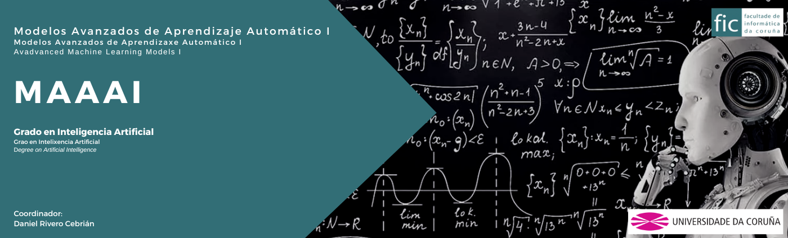

# Advanced Machine Learning Models I




## Introduction

Welcome to the **Advanced Machine Learning Models** repository! This repository contains resources utilized in the course **Modelos Avanzados de Aprendizaje Automático** of the **Bachelor's Degree in Artificial Intelligence** at the **Universidade da Coruña**. This course is part of an interuniversity program offered across the three universities of the **Galician University System (SUG)**.

## Course Overview

This course delves into advanced techniques in machine learning, equipping students with the knowledge and skills to tackle complex problems in various fields. Through a combination of theoretical knowledge and practical exercises, students will gain hands-on experience with cutting-edge machine learning methods. This repository is going to contain some quick notebooks for certain parts of the material, so for a complete reference of all practice, please refer to[udconline](https://udconline.udc.gal/)

## Programming Language

The practical component of the course will be conducted in [**Julia**](https://julialang.org/), a powerful programming language known for its high performance and ease of use in scientific computing and machine learning research. The exercises have been tested with version **1.9.2**, but they should also be compatible with earlier versions.

## Resources

- **Lecture Notes**: [Link to notes on [udconline](https://udconline.udc.gal/) the e-learning platform of teh University of A Coruña]
- **Exercises**: Practical coding exercises to enhance your understanding of advanced machine learning techniques.
- **Additional Readings**: Suggested literature to further explore the concepts discussed in class.

## Teaching Staff

- **Daniel Rivero Cebrián** (Course Coordinator)
- **Enrique Fernández Blanco**

## Getting Started

To get started with the resources in this repository, follow these steps:

1. Clone this repository to your local machine using:
   ```bash
   git clone https://github.com/ennanco/MIA_ML1.git
   ```
2. Navigate to the project directory
    ```bash
    cd MIA_MAAAI
    ```
3. Ensure you have Julia installed. If not, download it from [Julia's official website](https://julialang.org/)
4. Execute the examples in the notebooks within a Jupyter notebook environment.

## Contributing
We welcome contributions from students and enthusiasts alike! If you have suggestions for improvements or additional resources, feel free to fork the repository and submit a pull request.

## License
This project is licensed under the MIT License - see the [LICENSE](https://github.com/ennanco/GIA_MAAA1#MIT-1-ov-file) file for details.
